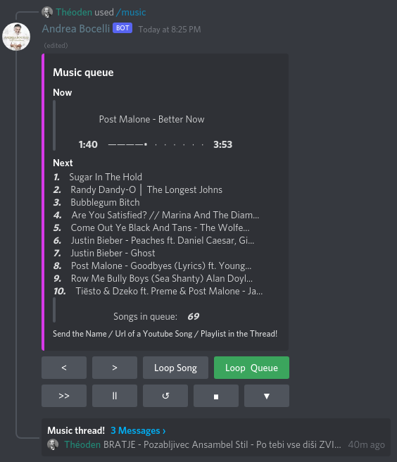

# Discord music bot

A discord bot for playing music, using [discord.js](https://discord.js.org/#/) in [nodeJS](https://nodejs.org/en/about/).

[invite bot](https://discord.com/api/oauth2/authorize?client_id=806226473069314048&permissions=51576375296&scope=bot%20applications.commands)

## Features

- `/music` command sends a new queue message and opens a music thread on that message.

- Only a single queue with a music thread may be active at once in a server.

- Songs are added by typing the name/url of a youtube song/playlist in the music thread.

- Deleting the queue message or thread will stop the music.

- Bot requires at least one unmuted (non bot) listener.
    - If no unmuted members are in the channel, bot will eventually disconnect.
    - Reconnect it by clicking `Join`.

- Queue message offers a variety of commands by clicking on buttons. (ex. loop, skip, shuffle, ... )

- User may only use music commands if they are undeafened in a voice channel and bot is either
in the same channel or not connected to any.

- Bot requires a `DJ` role. Only users with the same role may use the
music commands.

- For more info on the commands, click on `▼` button and then `Help` in the queue message in a discord channel.

## Required permissions

- View Channels
- Send Messages
- Read Message History
- Create Public Threads
- Connect
- Speak
- Use Voice Activity

##

## Additional Planned Features

- Allow administrator to personalize commands for different roles

## Development

For more info on developing the bot see [config](docs/CONFIG.md)
