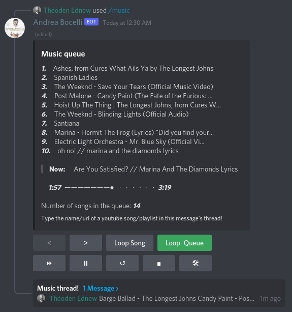

# Discord music bot

A discord bot for playing music, using [discord.js](https://discord.js.org/#/) in [nodeJS](https://nodejs.org/en/about/).

[invite bot](https://discord.com/api/oauth2/authorize?client_id=806226473069314048&permissions=51576375296&scope=bot%20applications.commands)

## Features

- `/music` command sends a new queue message and opens a music thread on that message.

- Sending a message in an archived music thread reopens it, if no other music thread is active.

- Only a single queue with a music thread may be active at once in a server.

- Queue message offers commands by clicking on buttons:
    - loop,
    - loop queue,
    - skip,
    - pause,
    - replay,
    - stop,
    - shuffle,
    - clear,
    - remove,
    - forward.

- Songs are added by typing the name/url of a youtube song/playlist in the music thread.

- Deleting the queue message or thread will stop the music.

- User may only use music commands if they are in a voice channel and bot is either
in the same channel or not connected to any.

- Bot requires a `DJ` role. Only users with the same role may use the
music commands.

## Required permissions

- View Channels
- Send Messages
- Create Public Threads
- Connect
- Speak
- Use Voice Activity

##

## Development

For more info on developing the bot see [config](docs/CONFIG.md)
